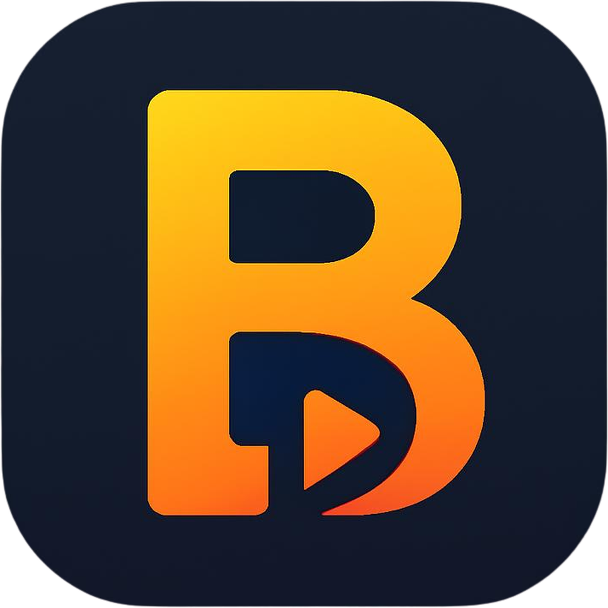
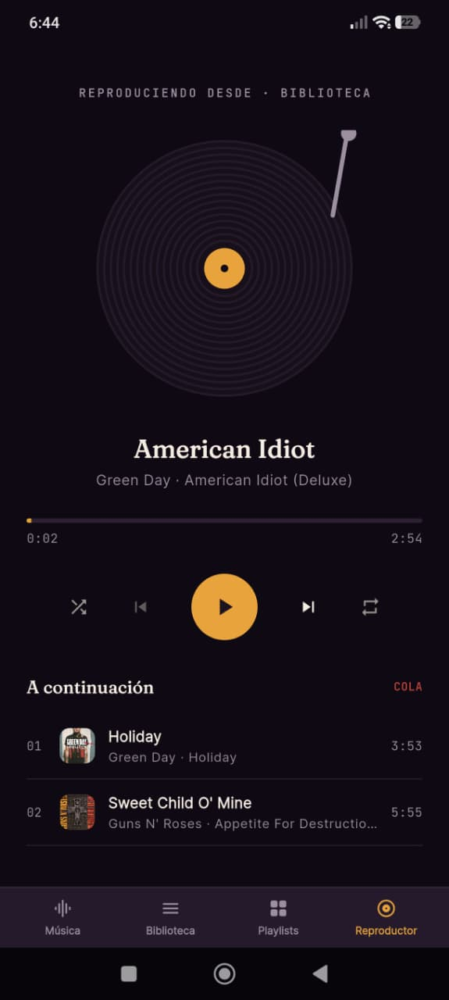
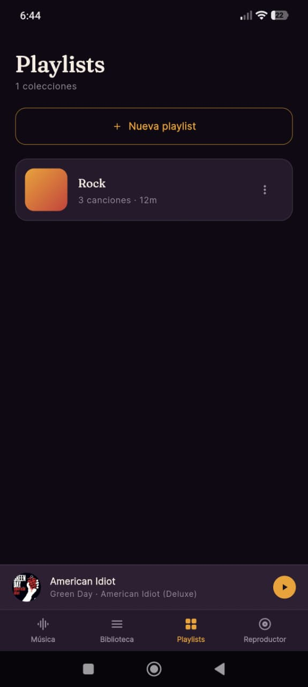

# BMusic 🎵

  

  Reproductor de música local para Android, construido con Flutter.

---

## 📱 Capturas de pantalla

  
  

## ✨ Características

- 🔍 Escaneo de tu biblioteca musical local
- ▶️ Reproducción de audio fluida
- 📃 Gestión de cola de reproducción
- 💿 Pantalla de reproductor completa con animación de vinilo
- 📴 Funciona 100% offline, sin necesidad de conexión a internet

## 🚧 En desarrollo

Funcionalidades planeadas para próximas versiones:

- Ecualizador de sonido

## 📥 Instalación

1. Ve a la sección [Releases](../../releases) de este repositorio.
2. Descarga el archivo `.apk` más reciente.
3. Instálalo en tu dispositivo Android (puede que necesites habilitar la instalación de fuentes desconocidas).

## 🛠️ Tecnologías

- [Flutter](https://flutter.dev/) — Framework de desarrollo multiplataforma
- Dart
